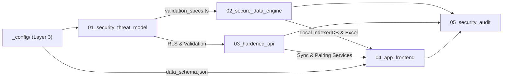

# ROUTING.md (Layer 1: Task Routing & Stage Execution Catalog)

This document routes execution across the numbered stages of the Curate Local-First CRM project.

---

## Stage Index

| Stage | Name | Job Description | Primary Deliverables |
| :--- | :--- | :--- | :--- |
| **01** | `01_security_threat_model` | Multi-tenant STRIDE threat model, RLS policies, and client validation specs | `threat_model.md`, `validation_specs.ts` |
| **02** | `02_secure_data_engine` | Local-First IndexedDB engine (Dexie.js) & client-side formula-safe Excel export | `db.ts`, `engine_verification_report.md` |
| **03** | `03_hardened_api` | Background Supabase sync service, cross-device pairing, and conflict resolution | `leadService.ts`, `workspaceService.ts` |
| **04** | `04_app_frontend` | React 19 + Tailwind v4 PWA with Workspace Switcher, Pairing Modal, and Sync Badge | `WorkspaceHeader.tsx`, `frontend_build_report.md` |
| **05** | `05_security_audit` | Verification tests (UUID collisions, LWW timestamp conflicts, formula fuzzing, RLS) | `security_audit_report.md`, `test_local_sync.ts` |

---

## Execution Dependencies

