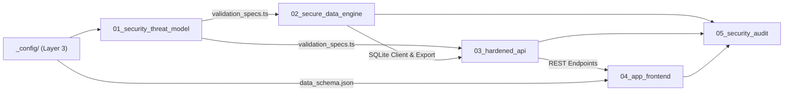

# ROUTING.md (Layer 1: Task Routing & Stage Execution Catalog)

This document routes execution across the numbered stages of the Curate project. Each stage reads from its declared inputs, executes its specific job, writes deliverables exclusively to its `output/` directory, and passes review before downstream stages consume it.

---

## Stage Index

| Stage | Name | Job Description | Primary Deliverables |
| :--- | :--- | :--- | :--- |
| **01** | `01_security_threat_model` | STRIDE threat modeling, formula injection mitigation, and validation specs | `threat_model.md`, `validation_specs.ts` |
| **02** | `02_secure_data_engine` | Concurrency-safe SQLite engine (`@libsql/client`) & sanitized Excel export | `engine_verification_report.md`, `test_engine.ts` |
| **03** | `03_hardened_api` | Express REST API with rate-limiting, Helmet CSP, Zod validation, and Excel streaming | `api_test_results.md`, `test_api.ts` |
| **04** | `04_app_frontend` | React 19 + Tailwind v4 responsive CRM dashboard, capture form, and PWA integration | `frontend_build_report.md` |
| **05** | `05_security_audit` | Penetration tests (Formula fuzzing, SQLite injection defense, DoS rate limits) | `security_audit_report.md`, `fuzz_formula_injection.ts` |

---

## Execution Dependencies

